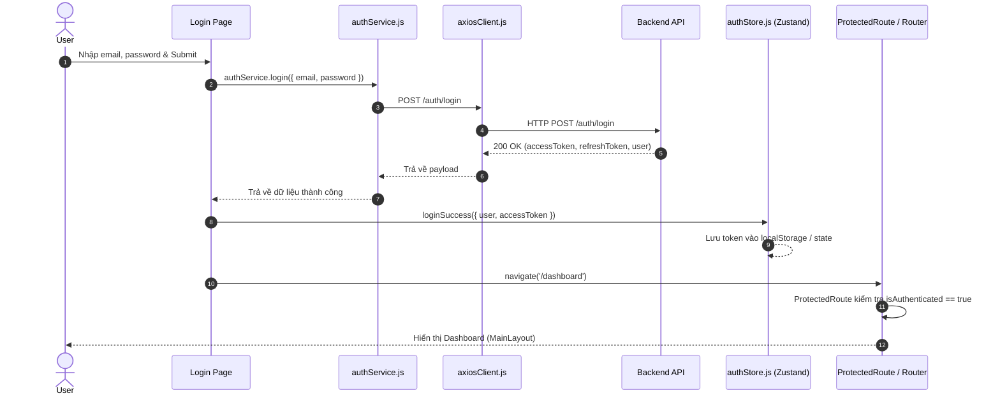

# TÀI LIỆU KIẾN TRÚC VÀ QUY CHUẨN FRONTEND SYSTEM

Tài liệu này định nghĩa cấu trúc thư mục, quy chuẩn lập trình (coding conventions), luồng xác thực (auth flow), và cung cấp mã nguồn khung (skeleton code) hoàn chỉnh cho ứng dụng Frontend (React + Vite + Zustand + Axios + React Router).

---

## MỤC LỤC
1. [Cấu trúc thư mục chuẩn](#1-cấu-trúc-thư-mục-chuẩn)
2. [Chi tiết vai trò & Ý nghĩa từng file/thư mục](#2-chi-tiết-vai-trò--ý-nghĩa-từng-filethư-mục)
3. [Quy ước code & Nguyên tắc kiến trúc](#3-quy-ước-code--nguyên-tắc-kiến-trúc)
4. [Luồng xác thực & Bảo vệ Route (Auth Flow)](#4-luồng-xác-thực--bảo-vệ-route-auth-flow)
5. [Mã nguồn Skeleton mẫu chuẩn](#5-mã-nguồn-skeleton-mẫu-chuẩn)
   - [5.1. Axios Client & Interceptor (axiosClient.js)](#51-axios-client--interceptor)
   - [5.2. Zustand Auth Store (authStore.js)](#52-zustand-auth-store)
   - [5.3. Service Layer (authService.js, aiChatService.js)](#53-service-layer)
   - [5.4. Route Protection & Routing (ProtectedRoute.jsx, router/index.jsx)](#54-route-protection--routing)
   - [5.5. Layouts (MainLayout.jsx, AuthLayout.jsx)](#55-layouts)
   - [5.6. Page & Style Mẫu (Login.jsx, Login.module.css)](#56-page--style-mẫu)
   - [5.7. Custom Hook (useDebounce.js)](#57-custom-hook)
6. [Dependencies khuyến nghị trong package.json](#6-dependencies-khuyến-nghị-trong-packagejson)

---

## 1. Cấu trúc thư mục chuẩn

```text
frontend/
├── public/                     # Static assets public trực tiếp (favicon, manifest, robot.txt)
├── src/
│   ├── assets/                 # Tài nguyên nội bộ: images, icons (SVG), global fonts
│   ├── components/             # Reusable UI components
│   │   ├── common/             # Thành phần UI atomic, dùng chung toàn app (Button, Input, Modal...)
│   │   └── layout/             # Các khối giao diện cố định (Sidebar, Header, Footer, Breadcrumb...)
│   ├── layouts/                # Wrapper bố cục cho các nhóm trang
│   │   ├── AuthLayout.jsx      # Layout độc lập cho trang Login / Register / Forgot Password
│   │   └── MainLayout.jsx      # Layout chính sau khi login (Sidebar + Header + Content Outlet)
│   ├── pages/                  # Các màn hình chính (Mỗi page là 1 folder riêng)
│   │   ├── Login/
│   │   │   ├── Login.jsx
│   │   │   └── Login.module.css
│   │   ├── Dashboard/
│   │   │   ├── Dashboard.jsx
│   │   │   └── Dashboard.module.css
│   │   ├── Workspace/
│   │   │   ├── Workspace.jsx
│   │   │   └── Workspace.module.css
│   │   ├── AIChat/
│   │   │   ├── AIChat.jsx
│   │   │   └── AIChat.module.css
│   │   └── Settings/
│   │       ├── Settings.jsx
│   │       └── Settings.module.css
│   ├── hooks/                  # Custom React hooks dùng chung
│   │   ├── useAuth.js          # Hook tiện ích bọc authStore hoặc logic phân quyền
│   │   ├── useFetch.js         # Hook gọi dữ liệu kèm trạng thái loading/error
│   │   └── useDebounce.js      # Hook debounce cho ô search, input autocomplete
│   ├── services/               # Tầng tương tác API (Tuyệt đối không gọi axios trực tiếp từ component)
│   │   ├── axiosClient.js      # Base instance axios + interceptor gắn token & handle refresh token
│   │   ├── authService.js      # API login, logout, refresh, get profile
│   │   ├── workspaceService.js # API CRUD workspace, tài liệu, dự án
│   │   └── aiChatService.js    # API chat AI, prompt, streaming response
│   ├── store/                  # Quản lý State toàn cục (Zustand)
│   │   ├── authStore.js        # State người dùng, trạng thái login, token, session
│   │   └── uiStore.js          # State giao diện: sidebar collapse, theme dark/light, notification badge
│   ├── router/                 # Cấu hình định tuyến (React Router v6+)
│   │   ├── index.jsx           # Bảng định tuyến tổng thể (Route map)
│   │   └── ProtectedRoute.jsx  # Route guard bảo vệ các trang yêu cầu đăng nhập
│   ├── utils/                  # Hàm tiện ích dùng chung
│   │   ├── formatDate.js       # Format datetime, relative time
│   │   └── validators.js       # Validate email, mật khẩu, form schema
│   ├── App.jsx                 # Root component cấu hình Provider, Theme, Toast Container
│   └── main.jsx                # Entry point gắn kết React DOM với index.html
├── .env                        # Biến môi trường local (VITE_API_BASE_URL, etc.)
└── package.json                # Định nghĩa thư viện & scripts
```

---

## 2. Chi tiết vai trò & Ý nghĩa từng file/thư mục

| Đường dẫn / Tên file | Phân loại | Mục đích và Trách nhiệm |
| :--- | :--- | :--- |
| `public/` | Thư mục | Chứa file tĩnh không qua xử lý của Webpack/Vite. Thường chứa `favicon.ico`, `manifest.json`, file robots, icons tĩnh bên ngoài. Truy cập trực tiếp qua root path `/`. |
| `src/assets/` | Thư mục | Chứa assets được bundle và tối ưu hóa bởi build tool: ảnh minh họa (`.png`, `.webp`), SVG icons, local fonts (`.woff2`). Hỗ trợ import trực tiếp vào JS/CSS. |
| `src/components/common/` | Thư mục | Các UI component cơ bản (Atoms/Molecules): `Button`, `Input`, `Modal`, `LoadingSpinner`, `Toast`, `Badge`. Đặc điểm: **Pure**, **không gắn chặt với nghiệp vụ cụ thể**, có thể tái sử dụng ở bất kỳ project nào. |
| `src/components/layout/` | Thư mục | Các thành phần giao diện cố định phục vụ layout tổng: `Header`, `Sidebar`, `Footer`, `UserDropdown`, `NotificationsMenu`. Chịu trách nhiệm hiển thị cấu trúc khung nhìn. |
| `src/layouts/AuthLayout.jsx` | File | Bố cục dành cho khách/chưa đăng nhập (Login, Register). Không có Sidebar hay Header phức tạp, thường chỉ là khung căn giữa màn hình hoặc chia đôi (banner bên trái, form bên phải). |
| `src/layouts/MainLayout.jsx` | File | Bố cục chính cho người dùng đã authenticated. Chứa `Sidebar` cố định bên trái, `Header` trên cùng, khu vực trung tâm chứa thẻ `<Outlet />` để render component của từng page tương ứng. |
| `src/pages/` | Thư mục | Mỗi thư mục con đại diện cho một màn hình (Route) độc lập. Áp dụng cơ chế **Feature Folder**: Mỗi page có `PageName.jsx` + `PageName.module.css`. Tránh để code trang phân tán. |
| `src/pages/Login/` | Thư mục | Màn hình đăng nhập tài khoản, xác thực thông tin, chuyển hướng sau khi đăng nhập thành công. |
| `src/pages/Dashboard/` | Thư mục | Màn hình tổng quan, hiển thị thống kê, hoạt động gần đây, biểu đồ tóm tắt tài nguyên của user. |
| `src/pages/Workspace/` | Thư mục | Quản lý không gian làm việc, tài liệu, dự án hoặc kho lưu trữ workspace của hệ thống. |
| `src/pages/AIChat/` | Thư mục | Giao diện hội thoại tương tác với AI Agent, stream tin nhắn, chọn prompt template, quản lý phiên chat. |
| `src/pages/Settings/` | Thư mục | Trang cấu hình tài khoản cá nhân, đổi mật khẩu, quản lý API key, theme và thông báo. |
| `src/hooks/` | Thư mục | Chứa các Custom Hooks đóng gói logic tái sử dụng liên quan đến React lifecycle, stateful logic mà không chứa JSX. |
| `src/hooks/useAuth.js` | File | Helper hook cung cấp thông tin user hiện tại, quyền hạn (roles), hàm `login`, `logout` lấy từ Zustand store. |
| `src/hooks/useFetch.js` | File | Tự động hóa việc gọi service, quản lý 3 trạng thái: `data`, `loading`, `error`. |
| `src/hooks/useDebounce.js` | File | Trì hoãn cập nhật giá trị (thường dùng cho ô search để tránh spam gọi API mỗi ký tự gõ). |
| `src/services/` | Thư mục | Tầng giao tiếp mạng (Network / API Layer). Tách biệt hoàn toàn việc gọi HTTP khỏi UI component. |
| `src/services/axiosClient.js` | File | Khởi tạo instance Axios, cấu hình `baseURL`, `timeout`, tự động đính kèm JWT Bearer token qua Request Interceptor, và xử lý mã lỗi (401 Unauthorized, refresh token) qua Response Interceptor. |
| `src/services/authService.js` | File | Tập hợp các API liên quan đến Authentication: `login(credentials)`, `register(data)`, `logout()`, `refreshToken()`, `getMe()`. |
| `src/services/workspaceService.js` | File | Các API CRUD liên quan đến Workspace: lấy danh sách workspace, tạo mới, chỉnh sửa, chia sẻ. |
| `src/services/aiChatService.js` | File | Các API tương tác với AI backend: gửi prompt, nhận phản hồi, quản lý chat history, streaming chat completions. |
| `src/store/` | Thư mục | Quản lý Global State bằng **Zustand** (nhẹ, nhanh, cú pháp tối giản hơn Redux). |
| `src/store/authStore.js` | File | Quản lý trạng thái xác thực: thông tin `user`, `token`, `isAuthenticated`, các action `setAuth`, `logout`, hỗ trợ lưu persisted vào `localStorage`. |
| `src/store/uiStore.js` | File | Quản lý trạng thái giao diện xuyên suốt: đóng/mở sidebar, theme sáng/tối (dark/light), ngôn ngữ hiển thị. |
| `src/router/index.jsx` | File | Thiết lập toàn bộ định tuyến của ứng dụng (bằng `react-router-dom`), phân định rõ Public Routes và Protected Routes. |
| `src/router/ProtectedRoute.jsx` | File | Route Guard kiểm tra trạng thái login từ `authStore`. Nếu chưa login -> redirect về `/login`. Nếu hợp lệ -> render `<Outlet />`. |
| `src/utils/formatDate.js` | File | Hàm chuẩn hóa hiển thị ngày giờ (VD: `DD/MM/YYYY`, `HH:mm`, relative time "5 phút trước"). |
| `src/utils/validators.js` | File | Các hàm kiểm tra tính hợp lệ của dữ liệu đầu vào: regex email, độ mạnh mật khẩu, kiểm tra chuỗi rỗng. |
| `src/App.jsx` | File | Root Component kết nối RouterProvider hoặc hiển thị các Provider bao quanh (ToastProvider, ThemeProvider). |
| `src/main.jsx` | File | Entry point của Vite, render component `<App />` vào thẻ `#root` trong `index.html`. |
| `.env` | File | Lưu trữ biến môi trường (ví dụ: `VITE_API_BASE_URL=http://localhost:3000/api`). |
| `package.json` | File | Quản lý danh sách thư viện phụ thuộc, scripts build, test, dev. |

---

## 3. Quy ước code & Nguyên tắc kiến trúc

### 3.1. Nguyên tắc phân tách trách nhiệm (Separation of Concerns)
1. **Không gọi API trực tiếp trong Component**:
   - ❌ **Sai**: `useEffect(() => { axios.get('/api/workspaces').then(...) }, [])` bên trong `Workspace.jsx`.
   - ✅ **Đúng**: `useEffect(() => { workspaceService.getAll().then(...) }, [])` hoặc dùng custom hook `useFetch(workspaceService.getAll)`.
2. **Page vs. Component**:
   - `pages/`: Đóng vai trò orchestrator (kết nối dữ liệu từ `services`/`store` rồi truyền props xuống các component con).
   - `components/common/`: Chỉ nhận `props`, hiển thị UI và emit sự kiện (pure components). Không truy xuất `authStore` hay gọi API nghiệp vụ trực tiếp.
3. **Mỗi Page có Folder riêng**:
   - Cấu trúc: `pages/<PageName>/<PageName>.jsx` và `<PageName>.module.css`.
   - Nếu page có component con đặc thù chỉ dùng riêng cho page đó: đặt tại `pages/<PageName>/components/`.

### 3.2. Quy chuẩn đặt tên (Naming Conventions)
- **React Components / Layouts**: Dùng `PascalCase` (VD: `Button.jsx`, `MainLayout.jsx`, `AIChat.jsx`).
- **Hooks**: Dùng `camelCase` có tiền tố `use` (VD: `useAuth.js`, `useDebounce.js`).
- **Services / Stores / Utils**: Dùng `camelCase` (VD: `axiosClient.js`, `authStore.js`, `formatDate.js`).
- **CSS Modules**: Dùng `<ComponentName>.module.css` để tránh xung đột CSS toàn cục (style isolation).

---

## 4. Luồng xác thực & Bảo vệ Route (Auth Flow)



### Xử lý Token hết hạn (401 Interceptor Flow):
1. Mọi request gửi đi được `axiosClient.js` tự động chèn `Authorization: Bearer <token>` thông qua **Request Interceptor**.
2. Khi backend trả về lỗi `401 Unauthorized`:
   - Response Interceptor bắt được mã 401.
   - Gọi `authStore.getState().logout()` để dọn dẹp state và `localStorage`.
   - Điều hướng người dùng về `/login?session_expired=true`.

---

## 5. Mã nguồn Skeleton mẫu chuẩn

### 5.1. Axios Client & Interceptor
**File: `src/services/axiosClient.js`**
```javascript
import axios from 'axios';
import { useAuthStore } from '../store/authStore';

const axiosClient = axios.create({
  baseURL: import.meta.env.VITE_API_BASE_URL || 'http://localhost:3000/api',
  headers: {
    'Content-Type': 'application/json',
  },
  timeout: 15000,
});

// Request Interceptor: Tự động đính kèm JWT Token
axiosClient.interceptors.request.use(
  (config) => {
    const token = useAuthStore.getState().token;
    if (token) {
      config.headers.Authorization = `Bearer ${token}`;
    }
    return config;
  },
  (error) => Promise.reject(error)
);

// Response Interceptor: Xử lý dữ liệu trả về & mã lỗi toàn cục (401)
axiosClient.interceptors.response.use(
  (response) => {
    // Trả về data trực tiếp để component không cần .data.data
    return response.data;
  },
  (error) => {
    if (error.response && error.response.status === 401) {
      // Token hết hạn hoặc không hợp lệ -> Logout
      useAuthStore.getState().logout();
      window.location.href = '/login';
    }
    return Promise.reject(error.response?.data || error.message);
  }
);

export default axiosClient;
```

---

### 5.2. Zustand Auth Store
**File: `src/store/authStore.js`**
```javascript
import { create } from 'zustand';
import { persist } from 'zustand/middleware';

export const useAuthStore = create(
  persist(
    (set) => ({
      user: null,
      token: null,
      isAuthenticated: false,

      // Action cập nhật thông tin đăng nhập thành công
      loginSuccess: (userData, token) =>
        set({
          user: userData,
          token: token,
          isAuthenticated: true,
        }),

      // Action đăng xuất
      logout: () =>
        set({
          user: null,
          token: null,
          isAuthenticated: false,
        }),

      // Cập nhật profile người dùng khi có thay đổi
      updateUser: (updatedUser) =>
        set((state) => ({
          user: { ...state.user, ...updatedUser },
        })),
    }),
    {
      name: 'auth-storage', // Key lưu trong localStorage
      partialize: (state) => ({
        user: state.user,
        token: state.token,
        isAuthenticated: state.isAuthenticated,
      }),
    }
  )
);
```

---

### 5.3. Service Layer

**File: `src/services/authService.js`**
```javascript
import axiosClient from './axiosClient';

export const authService = {
  login: async (credentials) => {
    return await axiosClient.post('/auth/login', credentials);
  },

  register: async (data) => {
    return await axiosClient.post('/auth/register', data);
  },

  getProfile: async () => {
    return await axiosClient.get('/auth/profile');
  },

  logout: async () => {
    return await axiosClient.post('/auth/logout');
  },
};
```

**File: `src/services/aiChatService.js`**
```javascript
import axiosClient from './axiosClient';

export const aiChatService = {
  sendMessage: async (messagePayload) => {
    return await axiosClient.post('/chat', messagePayload);
  },

  getChatHistory: async (sessionId) => {
    return await axiosClient.get(`/chat/history/${sessionId}`);
  },
};
```

---

### 5.4. Route Protection & Routing

**File: `src/router/ProtectedRoute.jsx`**
```javascript
import React from 'react';
import { Navigate, Outlet } from 'react-router-dom';
import { useAuthStore } from '../store/authStore';

const ProtectedRoute = () => {
  const isAuthenticated = useAuthStore((state) => state.isAuthenticated);

  // Nếu chưa đăng nhập -> Chuyển hướng về trang Login
  if (!isAuthenticated) {
    return <Navigate to="/login" replace />;
  }

  // Nếu đã đăng nhập -> Cho phép truy cập route con thông qua Outlet
  return <Outlet />;
};

export default ProtectedRoute;
```

**File: `src/router/index.jsx`**
```javascript
import React from 'react';
import { createBrowserRouter, Navigate } from 'react-router-dom';

// Layouts
import MainLayout from '../layouts/MainLayout';
import AuthLayout from '../layouts/AuthLayout';
import ProtectedRoute from './ProtectedRoute';

// Pages
import Login from '../pages/Login/Login';
import Dashboard from '../pages/Dashboard/Dashboard';
import Workspace from '../pages/Workspace/Workspace';
import AIChat from '../pages/AIChat/AIChat';
import Settings from '../pages/Settings/Settings';

export const router = createBrowserRouter([
  // Nhóm route xác thực (Không cần đăng nhập)
  {
    element: <AuthLayout />,
    children: [
      { path: '/login', element: <Login /> },
    ],
  },

  // Nhóm route bảo vệ (Bắt buộc phải đăng nhập)
  {
    element: <ProtectedRoute />,
    children: [
      {
        element: <MainLayout />,
        children: [
          { path: '/', element: <Navigate to="/dashboard" replace /> },
          { path: '/dashboard', element: <Dashboard /> },
          { path: '/workspace', element: <Workspace /> },
          { path: '/ai-chat', element: <AIChat /> },
          { path: '/settings', element: <Settings /> },
        ],
      },
    ],
  },

  // Fallback route cho 404
  {
    path: '*',
    element: <Navigate to="/login" replace />,
  },
]);
```

---

### 5.5. Layouts

**File: `src/layouts/MainLayout.jsx`**
```javascript
import React from 'react';
import { Outlet } from 'react-router-dom';
import Header from '../components/layout/Header';
import Sidebar from '../components/layout/Sidebar';

const MainLayout = () => {
  return (
    <div style={{ display: 'flex', minHeight: '100vh', width: '100%' }}>
      {/* Cột trái: Sidebar */}
      <Sidebar />

      {/* Cột phải: Header + Nội dung trang */}
      <div style={{ display: 'flex', flexDirection: 'column', flex: 1, overflow: 'hidden' }}>
        <Header />
        <main style={{ flex: 1, padding: '24px', overflowY: 'auto', background: '#f8fafc' }}>
          <Outlet />
        </main>
      </div>
    </div>
  );
};

export default MainLayout;
```

**File: `src/layouts/AuthLayout.jsx`**
```javascript
import React from 'react';
import { Outlet, Navigate } from 'react-router-dom';
import { useAuthStore } from '../store/authStore';

const AuthLayout = () => {
  const isAuthenticated = useAuthStore((state) => state.isAuthenticated);

  // Nếu người dùng đã đăng nhập rồi mà vẫn vào /login thì tự động chuyển hướng vào Dashboard
  if (isAuthenticated) {
    return <Navigate to="/dashboard" replace />;
  }

  return (
    <div style={{
      minHeight: '100vh',
      display: 'flex',
      alignItems: 'center',
      justifyContent: 'center',
      background: '#0f172a'
    }}>
      <Outlet />
    </div>
  );
};

export default AuthLayout;
```

---

### 5.6. Page & Style Mẫu

**File: `src/pages/Login/Login.jsx`**
```javascript
import React, { useState } from 'react';
import { useNavigate } from 'react-router-dom';
import { authService } from '../../services/authService';
import { useAuthStore } from '../../store/authStore';
import styles from './Login.module.css';

const Login = () => {
  const navigate = useNavigate();
  const loginSuccess = useAuthStore((state) => state.loginSuccess);

  const [formData, setFormData] = useState({ email: '', password: '' });
  const [loading, setLoading] = useState(false);
  const [errorMessage, setErrorMessage] = useState('');

  const handleChange = (e) => {
    setFormData((prev) => ({
      ...prev,
      [e.target.name]: e.target.value,
    }));
  };

  const handleSubmit = async (e) => {
    e.preventDefault();
    setLoading(true);
    setErrorMessage('');

    try {
      const response = await authService.login(formData);
      // Giả sử API trả về { user, token }
      loginSuccess(response.user, response.token);
      navigate('/dashboard');
    } catch (err) {
      setErrorMessage(err.message || 'Đăng nhập không thành công. Vui lòng thử lại!');
    } finally {
      setLoading(false);
    }
  };

  return (
    <div className={styles.loginCard}>
      <h2 className={styles.title}>Đăng Nhập Hệ Thống</h2>
      {errorMessage && <div className={styles.errorAlert}>{errorMessage}</div>}

      <form onSubmit={handleSubmit} className={styles.form}>
        <div className={styles.formGroup}>
          <label htmlFor="email">Email</label>
          <input
            id="email"
            name="email"
            type="email"
            required
            value={formData.email}
            onChange={handleChange}
            placeholder="name@example.com"
          />
        </div>

        <div className={styles.formGroup}>
          <label htmlFor="password">Mật khẩu</label>
          <input
            id="password"
            name="password"
            type="password"
            required
            value={formData.password}
            onChange={handleChange}
            placeholder="••••••••"
          />
        </div>

        <button type="submit" disabled={loading} className={styles.submitBtn}>
          {loading ? 'Đang xử lý...' : 'Đăng nhập'}
        </button>
      </form>
    </div>
  );
};

export default Login;
```

**File: `src/pages/Login/Login.module.css`**
```css
.loginCard {
  width: 100%;
  max-width: 400px;
  padding: 32px;
  background: #ffffff;
  border-radius: 12px;
  box-shadow: 0 10px 25px rgba(0, 0, 0, 0.2);
}

.title {
  margin-bottom: 24px;
  font-size: 24px;
  font-weight: 700;
  color: #1e293b;
  text-align: center;
}

.errorAlert {
  padding: 10px 14px;
  margin-bottom: 16px;
  border-radius: 6px;
  background-color: #fee2e2;
  color: #dc2626;
  font-size: 14px;
}

.form {
  display: flex;
  flex-direction: column;
  gap: 16px;
}

.formGroup {
  display: flex;
  flex-direction: column;
  gap: 6px;
}

.formGroup label {
  font-size: 14px;
  font-weight: 500;
  color: #475569;
}

.formGroup input {
  padding: 10px 12px;
  border: 1px solid #cbd5e1;
  border-radius: 6px;
  font-size: 14px;
  outline: none;
  transition: border-color 0.2s;
}

.formGroup input:focus {
  border-color: #2563eb;
}

.submitBtn {
  margin-top: 8px;
  padding: 12px;
  border: none;
  border-radius: 6px;
  background-color: #2563eb;
  color: #ffffff;
  font-weight: 600;
  cursor: pointer;
  transition: background-color 0.2s;
}

.submitBtn:hover {
  background-color: #1d4ed8;
}

.submitBtn:disabled {
  background-color: #94a3b8;
  cursor: not-allowed;
}
```

---

### 5.7. Custom Hook
**File: `src/hooks/useDebounce.js`**
```javascript
import { useState, useEffect } from 'react';

export function useDebounce(value, delay = 500) {
  const [debouncedValue, setDebouncedValue] = useState(value);

  useEffect(() => {
    const handler = setTimeout(() => {
      setDebouncedValue(value);
    }, delay);

    return () => {
      clearTimeout(handler);
    };
  }, [value, delay]);

  return debouncedValue;
}
```

---

## 6. Dependencies khuyến nghị trong package.json

Để triển khai hệ thống mượt mà theo cấu trúc trên, các thư viện cần thiết bao gồm:

```json
{
  "name": "frontend-system",
  "private": true,
  "version": "1.0.0",
  "type": "module",
  "scripts": {
    "dev": "vite",
    "build": "vite build",
    "preview": "vite preview"
  },
  "dependencies": {
    "axios": "^1.7.0",
    "react": "^18.3.1",
    "react-dom": "^18.3.1",
    "react-router-dom": "^6.26.0",
    "zustand": "^4.5.5",
    "lucide-react": "^0.439.0"
  },
  "devDependencies": {
    "@types/react": "^18.3.5",
    "@types/react-dom": "^18.3.0",
    "@vitejs/plugin-react": "^4.3.1",
    "vite": "^5.4.2"
  }
}
```

---

## 7. Tổng kết luồng phát triển tính năng mới (Workflow Checklist)

Khi phát triển thêm một tính năng mới (VD: tính năng `DocumentManager`):
1. **API Layer**: Tạo hàm gọi API tương ứng trong `src/services/documentService.js`.
2. **State Layer (nếu cần)**: Thêm store trong `src/store/documentStore.js` hoặc dùng local state trong component.
3. **Common Component (nếu cần)**: Nếu có UI tái sử dụng (như `DocumentCard`, `FileUploader`), đặt vào `src/components/common/`.
4. **Page Layer**: Tạo thư mục `src/pages/DocumentManager/` gồm `DocumentManager.jsx` và `DocumentManager.module.css`.
5. **Routing**: Đăng ký Route mới trong `src/router/index.jsx` (bên trong nhánh `ProtectedRoute -> MainLayout`).

